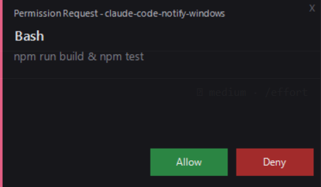

# claude-code-notify-windows

[](LICENSE)


Dark-themed WinForms notification popups for Claude Code on Windows. Zero dependencies, pure PowerShell.



## Features

- Passive toast notifications (auto-close 4s, click to dismiss)
- Interactive permission dialogs (Allow / Deny)
- Stop hook -- notifies when Claude finishes responding
- AskUserQuestion support -- dynamic option buttons + custom text input via "Other..."
- ExitPlanMode deferral -- shows "Open in terminal" for full native options
- Per-project accent colors -- deterministic palette based on project name
- Keyboard shortcuts: Enter=Allow, Esc=Deny, 1-9 for option selection
- Hover effects on all buttons
- Lockfile deduplication (no duplicate toast when permission dialog is open)
- Smart input preview: shows command for Bash, file_path for Read/Write/Edit, pattern for Glob/Grep
- Hidden from Alt+Tab -- popups don't clutter the task switcher
- Dark theme, bottom-right positioning, zero dependencies (WinForms + PowerShell 5.1)

## Quick Install

### Step 1 -- Download scripts

```powershell
New-Item -ItemType Directory -Force -Path "$env:USERPROFILE\.claude\hooks" | Out-Null
@('notify.ps1','notify-permission.ps1') | ForEach-Object {
    Invoke-WebRequest -Uri "https://raw.githubusercontent.com/deniaud/claude-code-notify-windows/main/$_" -OutFile "$env:USERPROFILE\.claude\hooks\$_"
}
```

### Step 2 -- Add hooks to settings

Add the following to `~/.claude/settings.json`:

```json
{
  "hooks": {
    "Notification": [
      {
        "matcher": "",
        "hooks": [
          {
            "type": "command",
            "command": "powershell -NoProfile -WindowStyle Hidden -File $HOME/.claude/hooks/notify.ps1"
          }
        ]
      }
    ],
    "PermissionRequest": [
      {
        "matcher": "",
        "hooks": [
          {
            "type": "command",
            "command": "powershell -NoProfile -File $HOME/.claude/hooks/notify-permission.ps1"
          }
        ]
      }
    ],
    "Stop": [
      {
        "matcher": "",
        "hooks": [
          {
            "type": "command",
            "command": "powershell -NoProfile -WindowStyle Hidden -File $HOME/.claude/hooks/notify.ps1"
          }
        ]
      }
    ]
  }
}
```

> Merge this into your existing `settings.json` -- don't replace the whole file.

### Step 3 -- Restart Claude Code

Restart Claude Code. No restart needed for script changes after initial setup.

## Automated Install

```powershell
irm https://raw.githubusercontent.com/deniaud/claude-code-notify-windows/main/install.ps1 | iex
```

## Testing

**Toast notification:**

```
echo '{"message":"Task completed","cwd":"C:/dev/my-project"}' | powershell -NoProfile -File ~/.claude/hooks/notify.ps1
```

**Permission dialog** (click Allow or press Enter):

```
echo '{"tool_name":"Bash","tool_input":{"command":"npm install"},"cwd":"C:/dev/my-project","hook_event_name":"PermissionRequest"}' | powershell -NoProfile -File ~/.claude/hooks/notify-permission.ps1
```

**AskUserQuestion** (click an option or press 1/2/3):

```
echo '{"tool_name":"AskUserQuestion","tool_input":{"questions":[{"question":"How to proceed?","header":"Pick","options":[{"label":"Yes","description":"Apply"},{"label":"No","description":"Skip"},{"label":"Other","description":"Custom"}],"multiSelect":false}]},"cwd":"C:/dev/my-project","hook_event_name":"PermissionRequest"}' | powershell -NoProfile -File ~/.claude/hooks/notify-permission.ps1
```

**ExitPlanMode:**

```
echo '{"tool_name":"ExitPlanMode","tool_input":{},"cwd":"C:/dev/my-project","hook_event_name":"PermissionRequest"}' | powershell -NoProfile -File ~/.claude/hooks/notify-permission.ps1
```

## Keyboard Shortcuts

| Mode | Enter | Escape | 1-9 |
|------|-------|--------|-----|
| Permission (Allow/Deny) | Allow | Deny | -- |
| AskUserQuestion | -- | Dismiss | Select option |
| ExitPlanMode | Open in terminal | Dismiss | -- |
| Toast notification | Dismiss | Dismiss | Dismiss |

## How It Works

- **Notification hook** fires when Claude goes idle, showing a passive toast in the bottom-right corner. Auto-closes after 4 seconds or on click/keypress.
- **PermissionRequest hook** fires when Claude needs tool approval. Blocks until the user responds with Allow, Deny, or an option selection.
- **Stop hook** fires when Claude finishes responding -- useful when you step away and want to know when it's done.
- A lockfile at `%TEMP%\claude-permission.lock` prevents duplicate toasts while a permission dialog is open.
- AskUserQuestion responses are returned via `updatedInput.answers` in the hook JSON output.

## Known Limitations

- Windows only

## Uninstall

Remove the hook scripts:

```powershell
Remove-Item "$env:USERPROFILE\.claude\hooks\notify.ps1" -ErrorAction SilentlyContinue
Remove-Item "$env:USERPROFILE\.claude\hooks\notify-permission.ps1" -ErrorAction SilentlyContinue
```

Then remove the `Notification`, `PermissionRequest`, and `Stop` entries from the `hooks` section in `~/.claude/settings.json`.

## License

MIT -- see [LICENSE](LICENSE).
